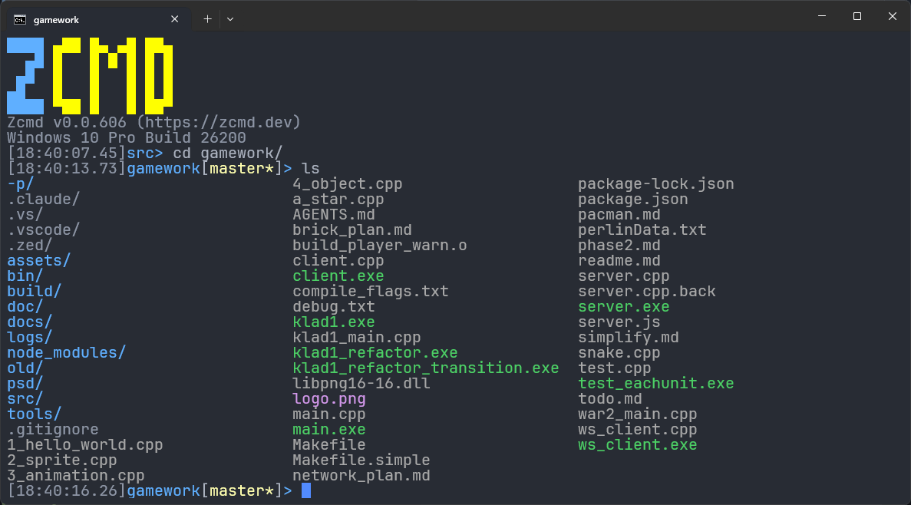
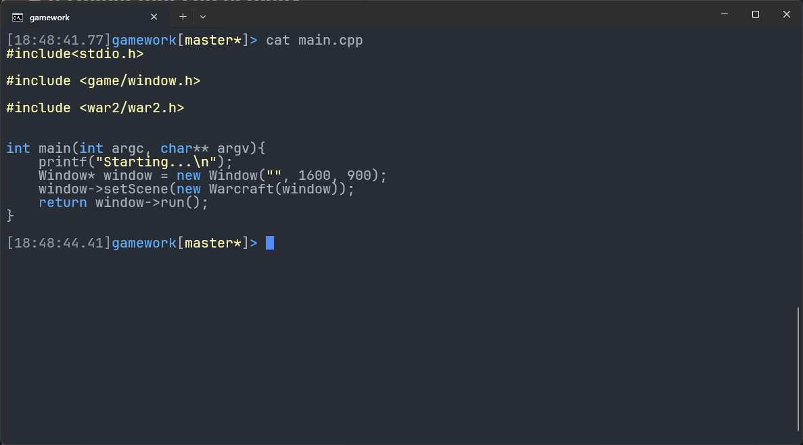
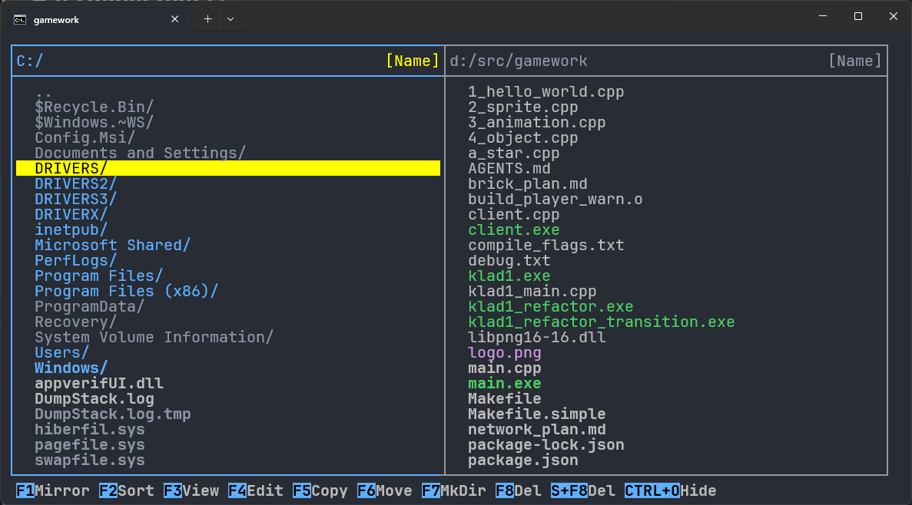
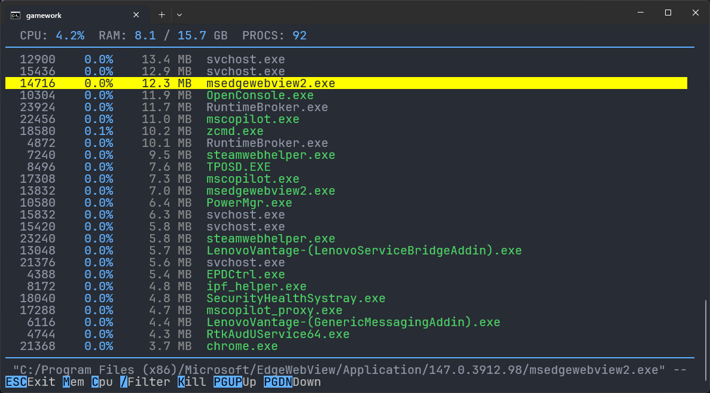
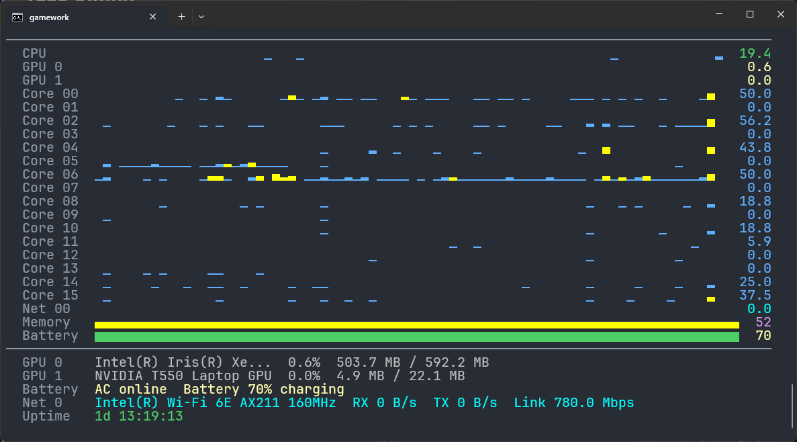
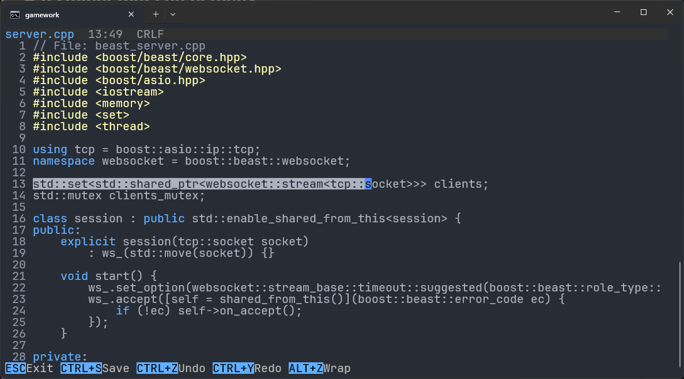
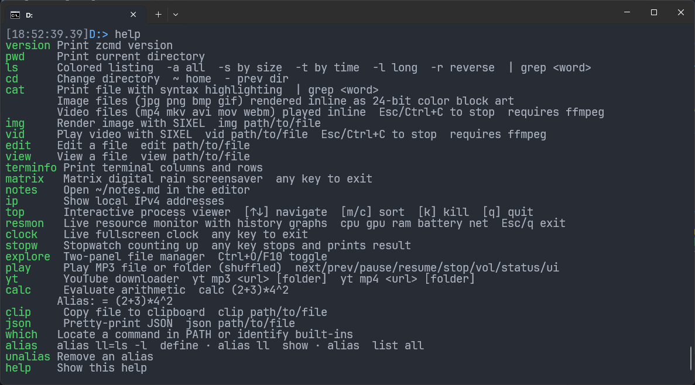

# Zcmd - Portable Windows Shell Replacement

> Zcmd is a portable, single executable Windows shell for `cmd.exe`-style workflows, with built-in tools for navigation, viewing, editing, monitoring, and media tasks.


Zcmd is a Windows shell implemented as a single native executable. It focuses on the interactive parts of a terminal session: prompt rendering, history, completion, file navigation, and a set of built-in commands.

It does not try to replace the wider Windows command ecosystem. Built-ins are handled directly in C++, and commands outside that set continue through `cmd.exe` so existing batch files and command-line tools still work.

The core shell is self-contained. Optional tools such as `ffmpeg` and `yt-dlp` are only needed for the media-related commands.

## What changes in daily use

- `ls` uses consistent file-type colors and supports sorting, filtering, and hidden-file handling.
- History persists across restarts and can be searched as you type.
- Tab completion works for relative paths such as `cd ../someth`.
- The prompt shows time, git branch, dirty state, exit code, and long-command timing.
- Paths are displayed with `/` separators in the UI.
- Entering a directory path and pressing Enter changes into that directory.




## Command model

Zcmd handles a fixed set of built-ins directly and forwards everything else to `cmd.exe`.

```text
Windows Terminal / VS Code / any terminal host
        |
        +-- zcmd.exe
              |
              +-- built-ins handled directly in C++
              |     prompt, history, hints, ls, cat, edit, explore, resmon...
              |
              +-- everything else -> cmd.exe /c <command>
                    batch files, redirection, pipes, &&, ||, %VAR%, existing tooling
```

This keeps normal Windows command compatibility while allowing the shell itself to provide its own prompt, history, navigation, and full-screen tools.

Some Windows-specific behaviors are handled explicitly:

- GUI apps can launch detached instead of hijacking the shell.
- Common env-mutating wrappers like version managers can update the current session instead of dying in a child process.
- Full-screen tools use the terminal cleanly and return you to the exact shell view you had before.

## Built-in commands

The prompt and file navigation are only part of the shell. Zcmd also includes a set of built-in full-screen and utility commands.

### `ls`

Colored listing, sorting, hidden-file handling, and filtering with `grep` or `findstr`.

### `cat`

Syntax-highlighted text, inline image rendering, and terminal video playback when `ffmpeg` is available.



### `explore`

A full-screen two-panel file explorer built into the shell. It supports sorting, filtering, selection, copy, move, recycle, and delete operations.



### `play`

Play a single MP3 or a folder, with shuffle, track navigation, pause, resume, and volume control.

### `top`

Interactive process viewer with sorting, filtering, and task termination.



### `resmon`

Live CPU, GPU, RAM, battery, and network history graphs in the terminal.



### `edit` and `view`

Built-in file editor and viewer with syntax highlighting.



### Other built-in tools

Zcmd also includes `yt`, `ip`, `calc`, `json`, `clip`, `clock`, `stopw`, `matrix`, and `notes`.

### `help`

Shows the built-in command list and short usage hints.



## Common commands

This is not the full manual. These are common examples:

- `ls -al`, `ls -tr`, `ls | grep foo`
- `cd -`, `cd --`, `cd ~~`
- `cat file.cpp`, `cat image.png`
- `edit path/to/file`
- `top`
- `explore`
- `resmon`
- `play folder/of/mp3s`
- `yt mp3 <url>`
- `which <command>`
- `alias ll=ls -l`

Everything else still falls through to `cmd.exe`, so existing Windows batch files and external toolchains keep working.

## Install and run

Download `zcmd.exe` from [Releases](../../releases), put it in a stable location, and point your terminal profile at it.

Windows Terminal:

```json
{
  "commandline": "D:/tools/zcmd/zcmd.exe"
}
```

VS Code:

```json
{
  "terminal.integrated.profiles.windows": {
    "Zcmd": {
      "path": ["D:/tools/zcmd/zcmd.exe"]
    }
  },
  "terminal.integrated.defaultProfile.windows": "Zcmd"
}
```

Optional extras:

- `ffmpeg` enables terminal video playback and powers `yt`
- `yt-dlp` enables `yt mp3` and `yt mp4`
- a terminal with ANSI and Unicode support is recommended

## Build

Build requirements:

- Windows
- `g++` on PATH, typically from MinGW-w64
- standard Windows system libraries available on the machine: `advapi32`, `shell32`, `iphlpapi`, `psapi`, `winmm`, `dxgi`, `pdh`

Run:

```bat
build.bat
```

That builds `zcmd.exe` and bumps the patch version on success.
